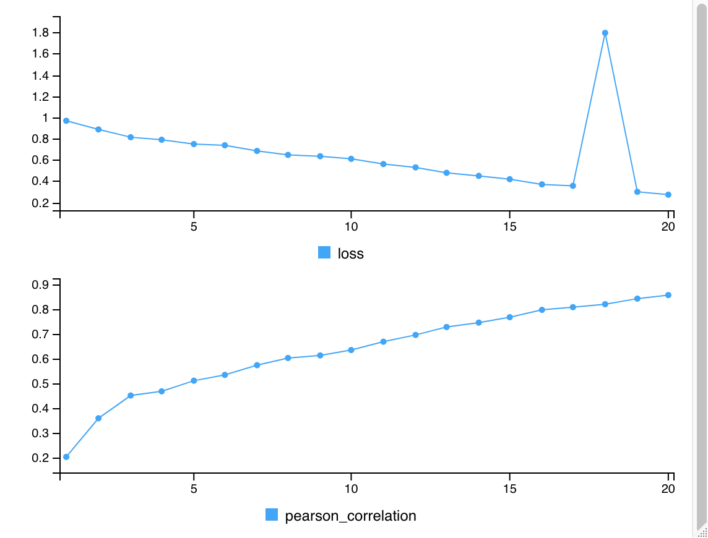
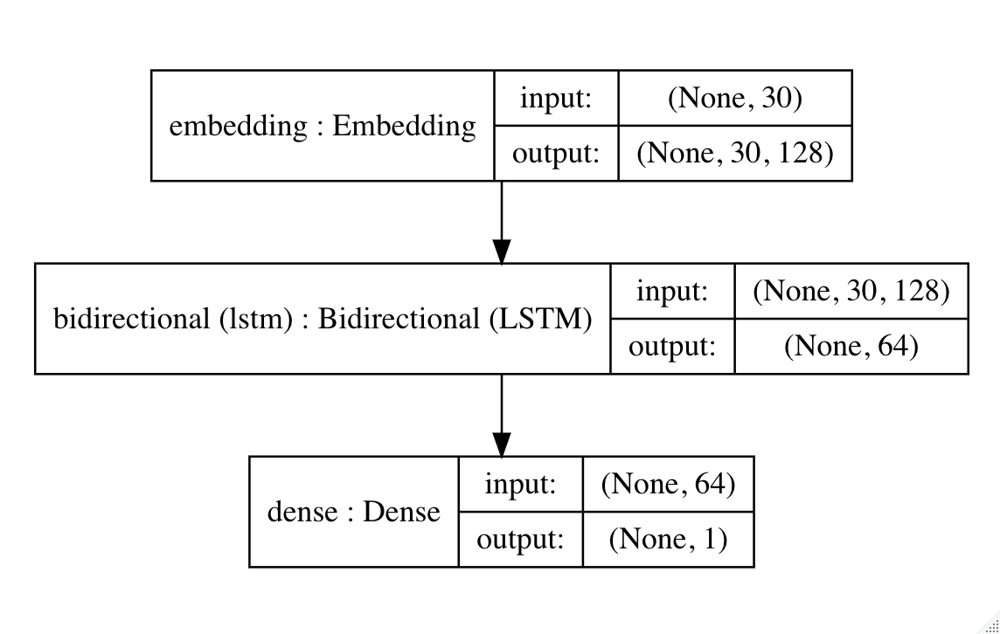

# ttgsea

## Introduction

Functional enrichment analysis methods such as gene set enrichment analysis (GSEA) have been widely used for analyzing gene expression data. GSEA is a powerful method to infer results of gene expression data at a level of gene sets by calculating enrichment scores for predefined sets of genes. GSEA depends on the availability and accuracy of gene sets. There are overlaps between terms of gene sets or categories because multiple terms may exist for a single biological process, and it can thus lead to redundancy within enriched terms. In other words, the sets of related terms are overlapping. Using deep learning, this pakage is aimed to predict enrichment scores for unique tokens or words from text in names of gene sets to resolve this overlapping set issue. Furthermore, we can coin a new term by combining tokens and find its enrichment score by predicting such a combined tokens.


## Installation

Python is required, although this is a R package. Furthermore, tensorflow and kears should be installed in Python and they should be connected to R, before installing this package (https://tensorflow.rstudio.com, https://keras.rstudio.com).

To install the stable version from Bioconductor:
```
if (!requireNamespace("BiocManager", quietly = TRUE))
    install.packages("BiocManager")
BiocManager::install("ttgsea")
```
To install the development version from GitHub:
``` 
devtools::install_github("dongminjung/ttgsea")
```


## Tutorial

The "airway" dataset has four cell lines with two conditions, control and treatment with dexamethasone. By using the package "DESeq2", differntially expressed genes  between controls and treated samples are identified from the gene expression data. Then the log2FC is used as a score for GSEA. For GSEA, GOBP for human is obtained from the package "org.Hs.eg.db", by using the package "BiocSet". GSEA is performed by the package "fgsea". Since "fgsea" can accept a list, the type of gene set is converted to a list. Finally, the result of GSEA is fitted to a deep learning model, and then enrichment scores of new terms can be predicted.

```
library(ttgsea)

## data preparation
library(airway)
data(airway)

## differentially expressed genes
library(DESeq2)
des <- DESeqDataSet(airway, design = ~ dex)
des <- DESeq(des)
res <- results(des)
head(res)
# log2FC used for GSEA
statistic <- res$"log2FoldChange"
names(statistic) <- rownames(res)
statistic <- na.omit(statistic)
head(statistic)
```

The log2FC is calculated for every gene with Ensemble Gene ID.
```
ENSG00000000003 ENSG00000000419 ENSG00000000457 ENSG00000000460 ENSG00000000938 ENSG00000000971 
     0.38125398     -0.20681260     -0.03792043      0.08816818      1.37822703     -0.42640213
```

Using the GOBP gene set, GSEA is performed.
```
## gene set
library(org.Hs.eg.db)
library(BiocSet)
go <- go_sets(org.Hs.eg.db, "ENSEMBL", ontology = "BP")
go <- as(go, "list")
# convert GO id to term name
library(GO.db)
names(go) <- Term(GOTERM)[names(go)]

## GSEA
library(fgsea)
set.seed(1)
fgseaRes <- fgsea(go, statistic)
head(fgseaRes[,-"leadingEdge"])
```

The result of GSEA contains names of pathways and enrichment scores.
```
                                              pathway       pval      padj    log2err
1:                 'de novo' AMP biosynthetic process 0.59126984 1.0000000 0.07011322
2:                 'de novo' CTP biosynthetic process 0.02202493 0.7889598 0.35248786
3:        'de novo' GDP-L-fucose biosynthetic process 0.72344689 1.0000000 0.06077195
4:                 'de novo' IMP biosynthetic process 0.68421053 1.0000000 0.06211242
5: 'de novo' NAD biosynthetic process from tryptophan 0.69094488 1.0000000 0.06211242
6:                 'de novo' UMP biosynthetic process 0.79518072 1.0000000 0.05641184
           ES        NES size
1:  0.5849699  0.9525488    3
2: -0.9523997 -1.4140498    2
3:  0.5771656  0.8519374    2
4:  0.4031617  0.8156349    6
5:  0.4328288  0.8303816    5
6: -0.4293014 -0.7200576    3
```

The main function of the package "ttgsea" is "fit_model" and it is used to build a deep learning model for predicting new terms. This function gives a trained model.
```
## tokenizing text of GSEA
# model parameters
num_tokens <- 5000
length_seq <- 30
batch_size <- 64
embedding_dims <- 128
num_units <- 32
epochs <- 20
# algorithm
ttgseaRes <- fit_model(fgseaRes, "pathway", "NES",
                       model = bi_lstm(num_tokens, embedding_dims,
                                       length_seq, num_units),
                       num_tokens = num_tokens,
                       length_seq = length_seq,
                       epochs = epochs,
                       batch_size = batch_size,
                       callbacks = keras::callback_early_stopping(
                         monitor = "loss",
                         patience = 5,
                         restore_best_weights = TRUE))
```

We can monitor the training process. Pearson correlation coefficient is used as a performance metric. Pearson correlation is a measure of how close the predicted value is to the true value. If it is close to 1, the model is considered a good fit. If it is close to 0, the model is not good. A value of 0 corresponds to a random prediction.
```
Epoch 1/20
183/183 [==============================] - 58s 315ms/step - loss: 0.9679 - pearson_correlation: 0.2008
Epoch 2/20
183/183 [==============================] - 60s 326ms/step - loss: 0.8863 - pearson_correlation: 0.3570
Epoch 3/20
183/183 [==============================] - 57s 312ms/step - loss: 0.8132 - pearson_correlation: 0.4489
Epoch 4/20
183/183 [==============================] - 60s 328ms/step - loss: 0.7895 - pearson_correlation: 0.4658
Epoch 5/20
183/183 [==============================] - 58s 319ms/step - loss: 0.7487 - pearson_correlation: 0.5088
Epoch 6/20
183/183 [==============================] - 69s 378ms/step - loss: 0.7373 - pearson_correlation: 0.5322
Epoch 7/20
183/183 [==============================] - 59s 325ms/step - loss: 0.6840 - pearson_correlation: 0.5714
Epoch 8/20
183/183 [==============================] - 59s 321ms/step - loss: 0.6468 - pearson_correlation: 0.6005
Epoch 9/20
183/183 [==============================] - 64s 349ms/step - loss: 0.6341 - pearson_correlation: 0.6109
Epoch 10/20
183/183 [==============================] - 59s 324ms/step - loss: 0.6095 - pearson_correlation: 0.6327
Epoch 11/20
183/183 [==============================] - 59s 321ms/step - loss: 0.5603 - pearson_correlation: 0.6663
Epoch 12/20
183/183 [==============================] - 59s 322ms/step - loss: 0.5289 - pearson_correlation: 0.6937
Epoch 13/20
183/183 [==============================] - 59s 322ms/step - loss: 0.4780 - pearson_correlation: 0.7257
Epoch 14/20
183/183 [==============================] - 59s 323ms/step - loss: 0.4492 - pearson_correlation: 0.7435
Epoch 15/20
183/183 [==============================] - 59s 323ms/step - loss: 0.4181 - pearson_correlation: 0.7654
Epoch 16/20
183/183 [==============================] - 60s 326ms/step - loss: 0.3691 - pearson_correlation: 0.7951
Epoch 17/20
183/183 [==============================] - 59s 324ms/step - loss: 0.3556 - pearson_correlation: 0.8060
Epoch 18/20
183/183 [==============================] - 59s 324ms/step - loss: 1.7955 - pearson_correlation: 0.8179
Epoch 19/20
183/183 [==============================] - 59s 323ms/step - loss: 0.2990 - pearson_correlation: 0.8405
Epoch 20/20
183/183 [==============================] - 60s 327ms/step - loss: 0.2720 - pearson_correlation: 0.8548
```



The enrichment score of every token is predicted.
```
# prediction
ttgseaRes$token_pred
```

The helper T cell seems to have a small negative value.
```
             token_term      pred
   1:           SA node  2.914987
   2: dicarboxylic acid  2.786132
   3:   heart induction  2.578254
   4:            1 beta  2.493106
   5:     break process  2.484926
  ---                            
4996:          T helper -1.991685
4997:  response peptide -2.011833
4998:              edit -2.135143
4999:          helper T -2.139603
5000:       helper cell -2.143030
```

The trained model is used for predicting new terms.
```
set.seed(1)
predict_model(ttgseaRes, c("translation response",
                           "cytokine activity",
                           "rhodopsin mediate",
                           "granzyme",
                           "histone deacetylation",
                           "helper T cell",
                           "Wnt"))
```

In the table, "test_value" is the predicted enrichment score. We can get the enrichment score for word or phrase.
```
               new_text test_value MC_p_value adj_p_value
1  translation response  1.5176259      0.026  0.06066667
2     cytokine activity  2.1312644      0.000  0.00000000
3     rhodopsin mediate -1.2944517      0.078  0.10500000
4              granzyme -1.5796263      0.014  0.04900000
5 histone deacetylation -0.7845942      0.298  0.29800000
6         helper T cell -1.2319267      0.050  0.08750000
7                   Wnt -1.0362499      0.090  0.10500000
```

The function "plot_model" draws the plot for model architecture.
```
plot_model(ttgseaRes$model)
```


